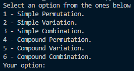
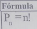
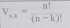
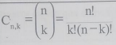
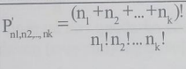
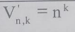
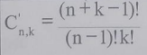

<table>
    <tr>
        <td>
            
        </td>
        <td>
            
        </td>
    </tr>
</table></br>

---

# Combinatorial Calculus PyApp. 🧮👨‍💻
---

<details>
  <summary>:zap: GitHub Stats</summary>
    <br><br>
</details>

<details>
    <summary>:zap: Most Used Languages</summary>
    <br>
</details>

---

```python
def ShowNewSkill():
    print("Upgrading my skills [Python Version!]")
```
---

# How to use it: ⤵️

#### ▶️ **Run the [Main.exe]** and choose from the listed options.
<table>
    <th>Menu of the App</th>
    <tr>
        <td>
            
        </td>
    </tr>
</table>

▶️ By **selecting option 1**, you will be able to perform the calculation through a _Simple Permutation_ using the formula: ⤵️
<table>
    <th>Simple Permutation's Formula</th>
    <tr>
        <td>
            
        </td>
    </tr>
</table>

▶️ By **selecting option 2**, you will be able to perform the calculation through a _Simple Variation_ using the formula: ⤵️
<table>
    <th>Simple Variation's Formula</th>
    <tr>
        <td>
            
        </td>
    </tr>
</table>

▶️ By **selecting option 3**, you will be able to perform the calculation through a _Simple Combination_ using the formula: ⤵️
<table>
    <th>Simple Combination's Formula</th>
    <tr>
        <td>
            
        </td>
    </tr>
</table>

▶️ By **selecting option 4**, you will be able to perform the calculation through a _Composed Permutation_ using the formula: ⤵️
<table>
    <th>Composed Permutation's Formula</th>
    <tr>
        <td>
            
        </td>
    </tr>
</table>

▶️ By **selecting option 5**, you will be able to perform the calculation through a _Composed Variation_ using the formula: ⤵️
<table>
    <th>Composed Variation's Formula</th>
    <tr>
        <td>
            
        </td>
    </tr>
</table>

▶️ By **selecting option 6**, you will be able to perform the calculation through a _Composed Combination_ using the formula: ⤵️
<table>
    <th>Composed Combination's Formula</th>
    <tr>
        <td>
            
        </td>
    </tr>
</table>


---
## Technologies used. 📌
|<a href="https://www.python.org/">|<h3>Python</h3>|
|--------|----------|

---

## License 📄
This project is under license \[MIT License\] - read the file [LICENSE.md](LICENSE) for details.

---

## Where to find me: 🌎
|||
|------------|------------|
|🤴 Facu Falcone|Junior Developer|
||<center><a href="https://github.com/caidevOficial/">Github</a></center>|
||<a href="https://www.linkedin.com/in/facundo-falcone/">LinkedIn</a>|
||<a href="https://cafecito.app/caidevoficial/">CafecitoApp</a>|