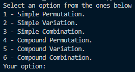
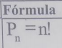
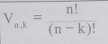
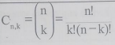
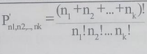
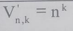
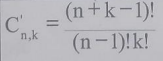
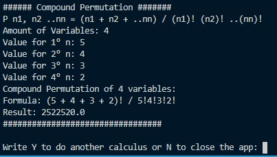

<table>
    <tr>
        <td>
            
        </td>
        <td>
            
        </td>
    </tr>
</table></br>


<p align="center">
    
</p>

---

# Combinatorial Calculus PyApp. 🧮👨‍💻
---

<details>
  <summary>:zap: GitHub Stats</summary>
    <br><br>
</details>

<details>
    <summary>:zap: Most Used Languages</summary>
    <br>
</details>

---

```python
def ShowNewSkill():
    print("Upgrading my skills [Python Version!]")
```
---

# How to use it: ⤵️

#### ▶️ **Run the [Main.exe]** and choose from the listed options.
<table>
    <th>Menu of the App</th>
    <tr>
        <td>
            
        </td>
    </tr>
</table>

▶️ By **selecting option 1**, you will be able to perform the calculation through a _Simple Permutation_ using the formula: ⤵️
<table>
    <th>Simple Permutation's Formula</th>
    <tr>
        <td>
            
        </td>
    </tr>
</table>

▶️ By **selecting option 2**, you will be able to perform the calculation through a _Simple Variation_ using the formula: ⤵️
<table>
    <th>Simple Variation's Formula</th>
    <tr>
        <td>
            
        </td>
    </tr>
</table>

▶️ By **selecting option 3**, you will be able to perform the calculation through a _Simple Combination_ using the formula: ⤵️
<table>
    <th>Simple Combination's Formula</th>
    <tr>
        <td>
            
        </td>
    </tr>
</table>

▶️ By **selecting option 4**, you will be able to perform the calculation through a _Compound Permutation_ using the formula: ⤵️
<table>
    <th>Compound Permutation's Formula</th>
    <tr>
        <td>
            
        </td>
    </tr>
</table>

▶️ By **selecting option 5**, you will be able to perform the calculation through a _Compound Variation_ using the formula: ⤵️
<table>
    <th>Compound Variation's Formula</th>
    <tr>
        <td>
            
        </td>
    </tr>
</table>

▶️ By **selecting option 6**, you will be able to perform the calculation through a _Compound Combination_ using the formula: ⤵️
<table>
    <th>Compound Combination's Formula</th>
    <tr>
        <td>
            
        </td>
    </tr>
</table>

When using each of the methods, the application will show you the chosen variables, the formula with those variables and of course, the result of said equation.

<table>
    <th>Compound Permutation's Sample</th>
    <tr>
        <td>
            
        </td>
    </tr>
</table>

---
## Technologies used. 📌
|<a href="https://www.python.org/">|<h3>Python</h3>|
|--------|----------|

---

## License 📄
This project is under license \[MIT License\], for more details read the file -> [LICENSE.md](LICENSE) .

## Releases 📌
You can find the differents versions or releases in the following link -> [Releases](https://github.com/caidevOficial/Python_CombinatorialCalculus/releases)

---

## Where to find me: 🌎

<table>
  <theader>
    <tr align='center'>
      <td>
        
      </td>
    </tr>
    <th><center>🤴 Facu Falcone - Data Engineer</center></th>
    </theader>
    <tbody>
    <tr align='center'>
      <td>
      <a href="https://github.com/caidevOficial/"></a>
      </td>
    </tr>
    <tr align='center'>
      <td>
        <a href="https://www.linkedin.com/in/facundo-falcone/"></a>
      </td>
    </tr>
    <tr align='center'>
      <td>
        <a href="https://cafecito.app/caidevoficial/"></a>
      </td>
    </tr>
    <tr align='center'>
      <td>
        <a href='https://ko-fi.com/P5P74JBOH' target='_blank'></a>
      </td>
    </tr>
  </tbody>
</table>
